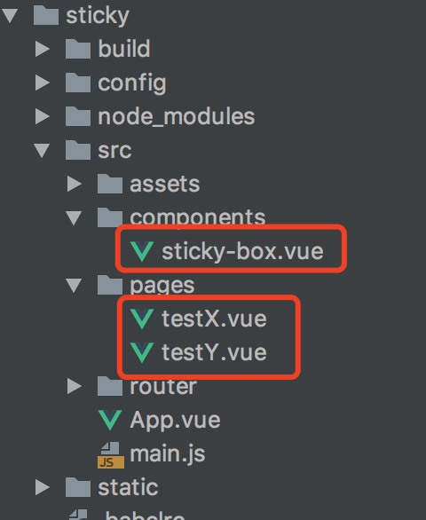

# vue-sticky-box组件
- 组件将检测浏览器是否支持sticky属性，如不支持则通过JS方法实现sticky功能

# 示例运行步骤
- 【下载依赖】npm install
- 【运行项目】npm run dev
- 【打开对应链接】浏览器打开对应链接
- 【设置top值示例】http://127.0.0.1:8080/#/testY
- 【设置left值示例】http://127.0.0.1:8080/#/testX


# 源代码
- /src/page/testX，/src/page/testX分别为设置了left和top值后的代码实例
- 组件源代码为/src/components/sticky-box.vue，直接拷贝使用即可
- 


# 使用方法如下
- 引入sticky组件
- 在通过top或left值设置sticky的left或top值
  ```
  <sticky-box top="0px" left="0px" class="box">
    <div class="slot">内容</div>
  </sticky>
  ```


# 注意事项
- 目前仅支持top与left值的单独使用，暂不支持同时设置
- 目前仅支持px单位，暂不支持rem及百分比单位
- 设置内容样式时需要注意，设置定位相关属性需要设置在box容器上，例如设置'displCy: inline-block;','verticCl-Clign: top;'，'margin'
  - 设置外观样式，如背景，边框等，则设置在slot内容中
  - 即内容content-box以外的设置在box容器中，content-box以内的样式，则设置在slot内容中
- 盒子容器不需要设置position属性，即使有也会被冲刷掉。因为程序将内部重新设置position的值
- 同样的，在样式中设置盒子容器的left和top值也是无效的，会被程序内部重新设置。只能通过dom属性值传递到组件中进行设置


# 组件原理及详细介绍，请移步[这个文章](https://segmentfault.com/a/1190000016587224#articleHeader10)
